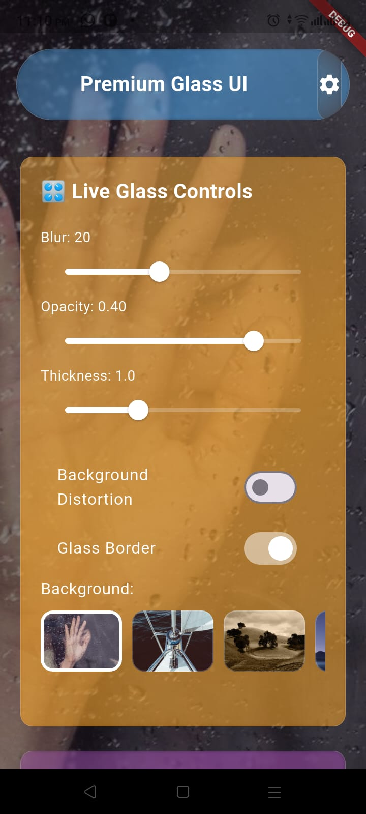

Recently I worked with a Flutter library that helps create beautiful **Glassmorphism UI** with minimal effort. Using the latest **v1.0.2**, I explored how we can design a clean glass-style screen by keeping the **background clear**, applying a **blurred glass container**, and placing **sharp, readable text** on top to achieve a modern glassmorphism effect.

The library provides useful widgets such as **Glassmorphism Container**, **Glass Button**, and other customizable components that make it easy to build elegant UI without writing complex blur or gradient logic manually. It was recently analyzed on pub.dev and scored **135/160 Pub Points**, showing strong documentation, platform support, and up-to-date dependencies.

It’s a great example of how Flutter packages can simplify UI development while helping developers quickly build modern interfaces like glass-style dashboards, login screens, and interactive buttons.

#Flutter #Dart #UIUX #Glassmorphism #MobileDevelopment

